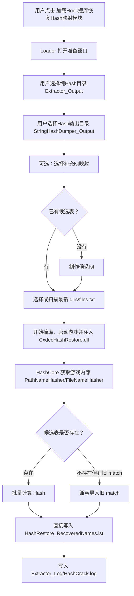

# Hash 恢复模块开发文档

本文记录当前 `KrkrExtractForCxdecV2Extra` 中 Hash 映射恢复相关模块的设计、文件格式、运行流程与维护注意点。重点覆盖两个入口：

- `加载运行时恢复Hash映射模块`
- `加载Hook撞库恢复Hash映射模块`

相关源码：

- `CxdecExtractorLoader/CxdecExtractorLoader.cpp`
- `CxdecStringDumper/HashCore.cpp`
- `CxdecStringDumper/HashRestoreUI.cpp`
- `CxdecStringDumper/RuntimeHashUI.cpp`
- `CxdecHashRestore/dllmain.cpp`
- `CxdecHashRestore/HashCrackApplication.cpp`

## 1. 目录与文件角色

典型游戏副本目录结构：

```text
游戏目录/
  game.exe
  Extractor_Output/
    纯Hash解包结果...
    Extractor_Log/
      HashRestore.log
      HashCrack.log
      HashRestore_Report.tsv
      HashRestore_Unresolved.log
  StringHashDumper_Output/
    DirectoryHash.log
    FileNameHash.log
    Universal.log
    HashRestore_RecoveredNames.lst
    dirs_2026_06_10_21_49.txt
    files_2026_06_10_21_49.txt
```

### `Extractor_Output`

纯 Hash 解包结果目录。恢复模块会在这个目录中实时扫描 Hash 文件夹和 Hash 文件名，并按映射表尝试改名或移动到明文路径。

### `StringHashDumper_Output`

Hash 映射输出目录。运行时恢复、Hook 撞库恢复、补充映射导入都会围绕这个目录读写映射数据。

### `Extractor_Log`

恢复过程日志目录。现在统一优先写在用户选择的纯 Hash 目录下：

```text
Extractor_Output/Extractor_Log/
```

如果 Hook 撞库流程没有拿到纯 Hash 目录环境变量，则退回写到 Hash 输出目录下的 `Extractor_Log`。

## 2. 映射文件格式

### 2.1 运行时 Hash 日志

`DirectoryHash.log` 和 `FileNameHash.log` 来自运行时 Hook，格式为：

```text
真实名字##YSig##HASH
```

例子：

```text
krmovie.dll##YSig##347FD75A5D958E31F1A682BDB4D0A6A83D37F6E0FDC599EBAFA261970CEA5B0C
%EmptyString%##YSig##94D4A97C61498621
image/演出小物/##YSig##AC6C29A69ADFF5E1
```

规则：

- `FileNameHash.log`：文件名 Hash 映射。
- `DirectoryHash.log`：目录 Hash 映射。
- `%EmptyString%` 表示根目录，恢复列表中统一记为 `/`。
- 嵌套目录保留 `/`，如 `image/演出小物`。

### 2.2 恢复映射表

`HashRestore_RecoveredNames.lst` 是跨模块共享的恢复映射表，格式为：

```text
HASH:name
```

例子：

```text
94D4A97C61498621:/
AC6C29A69ADFF5E1:image/演出小物
347FD75A5D958E31F1A682BDB4D0A6A83D37F6E0FDC599EBAFA261970CEA5B0C:krmovie.dll
```

规则：

- Hash 统一转成大写。
- 目录分隔符统一为 `/`。
- 空名和 `%EmptyString%` 统一转成 `/`。
- 支持 16 位目录 Hash 和 64 位文件 Hash。
- 文件使用 UTF-8 保存，方便外部工具复用。
- 重复行用 `unordered_set` 去重，写回时排序。

排序策略：

1. 16 位 Hash 在前。
2. 64 位 Hash 在后。
3. 同类 Hash 按 name 不区分大小写排序。
4. name 相同时按整行不区分大小写排序。

### 2.3 候选表

候选表用于 Hook 撞库前批量计算 Hash。

```text
dirs_年_月_日_时_分.txt
files_年_月_日_时_分.txt
```

当前由 UI 从纯 Hash 目录批量收集生成：

- `dirs_*.txt`：候选目录名。
- `files_*.txt`：候选文件名。

候选表写到 `StringHashDumper_Output`。

候选表是一次性输入。Hook 撞库完成后，如果候选表位于当前 Hash 输出目录中，会被归档为 `_tmp.txt` 后缀，例如：

```text
dirs_2026_06_10_22_33_12.txt
dirs_2026_06_10_22_33_12_tmp.txt
```

`重新扫描最新候选` 会跳过 `_tmp` 和 `_match` 文件，避免下次误选旧临时文件或旧版中间结果。

### 2.4 旧版撞库结果

旧版流程会生成中间 match 文件：

```text
dirs_年_月_日_时_分_match.txt
files_年_月_日_时_分_match.txt
```

格式为：

```text
name,hash
```

例子：

```text
image/演出小物,AC6C29A69ADFF5E1
krmovie.dll,347FD75A5D958E31F1A682BDB4D0A6A83D37F6E0FDC599EBAFA261970CEA5B0C
```

当前 `HashCore.cpp` 会在撞库线程中把 `_match.txt` 一步导入 `HashRestore_RecoveredNames.lst`，转换为：

```text
HASH:name
```

新版流程不再主动生成 `_match.txt`。Hook 撞库会直接从候选表计算 Hash，并写入 `HashRestore_RecoveredNames.lst`。保留 `_match.txt` 导入逻辑只是为了兼容已经存在的旧结果。

## 3. 模块入口与职责

### 3.1 Loader

入口文件：`CxdecExtractorLoader/CxdecExtractorLoader.cpp`

Loader 负责展示模块按钮、准备 UI、启动游戏并注入 DLL。

当前相关按钮名：

- `加载运行时恢复Hash映射模块`
- `加载Hook撞库恢复Hash映射模块`

Hook 撞库恢复模块会弹出准备窗口，不会点击后立刻启动游戏。用户需要先确认：

1. 纯 Hash 目录。
2. Hash 输出目录。
3. 补充 lst 映射。
4. 候选目录表。
5. 候选文件表。

然后用户可以：

- 点击 `制作候选lst`：从纯 Hash 目录收集候选名，并写入 `StringHashDumper_Output`。
- 点击 `重新扫描最新候选`：自动填入最新的 `dirs_*.txt` 和 `files_*.txt`。
- 点击 `开始撞库`：启动游戏并注入 `CxdecHashRestore.dll`。

点击 `开始撞库` 后，Loader 主窗口不会立刻关闭。它会复用主窗口中的进度条显示 Hook 撞库进度，并在完成后弹出成功提示。准备窗口本身会关闭，主窗口负责保留进度反馈。

### 3.2 运行时恢复模块

入口文件：

- `CxdecStringDumper/RuntimeHashUI.cpp`
- `CxdecStringDumper/HashRestoreUI.cpp`
- `CxdecStringDumper/HashCore.cpp`

用途：

- 运行游戏时继续追加 `DirectoryHash.log` 和 `FileNameHash.log`。
- 实时根据已有映射恢复纯 Hash 目录。
- 写入恢复进度与失败记录。

日志：

```text
Extractor_Output/Extractor_Log/RuntimeHashRestore.log
Extractor_Output/Extractor_Log/HashRestore.log
Extractor_Output/Extractor_Log/HashRestore_Report.tsv
Extractor_Output/Extractor_Log/HashRestore_Unresolved.log
```

### 3.3 Hook 撞库恢复模块

入口文件：

- `CxdecHashRestore/dllmain.cpp`
- `CxdecHashRestore/HashCrackApplication.cpp`
- `CxdecStringDumper/HashCore.cpp`

用途：

- 注入游戏进程。
- 获取游戏内部 Hash 计算器。
- 对候选目录名和文件名批量计算 Hash。
- 直接写入 `HashRestore_RecoveredNames.lst`。
- 在没有候选表时，可以兼容导入已有 `_match.txt`。

`CxdecHashRestore.dll` 不依赖改名为 `version.dll` 的加载方式；当前走 Loader + Detours 注入。

## 4. 环境变量约定

Loader 启动 Hook 撞库模块前会设置环境变量，DLL 读取这些变量决定流程。

| 环境变量 | 作用 |
| --- | --- |
| `CXDEC_HASH_CRACK_MODE` | 由 `CxdecHashRestore.dll` 设置为 `1`，表示当前处于 Hook 撞库模式 |
| `CXDEC_HASH_CRACK_OUTPUT_DIR` | Hash 输出目录，通常是 `StringHashDumper_Output` |
| `CXDEC_HASH_CRACK_DIRS_FILE` | 用户选择的目录候选表 |
| `CXDEC_HASH_CRACK_FILES_FILE` | 用户选择的文件候选表 |
| `CXDEC_HASH_CRACK_PURE_HASH_DIR` | 用户选择的纯 Hash 目录，通常是 `Extractor_Output` |
| `CXDEC_HASH_CRACK_SUPPLEMENTAL_MAP` | 用户选择的补充 lst 映射 |
| `CXDEC_HASH_CRACK_SUPPRESS_RESTORE_UI` | 设置为 `1` 时，Hook 撞库 DLL 不再弹出第二个恢复 UI |

`CXDEC_HASH_CRACK_SUPPRESS_RESTORE_UI=1` 很重要，它用于避免 Hook 撞库模块启动后又弹出一套恢复窗口，导致两个 UI 流程互相打架。

## 5. Hook 撞库完整流程



### 当前实现细节

`HashCore.cpp` 中的撞库线程会：

1. 读取已有 `HashRestore_RecoveredNames.lst`。
2. 读取补充 lst。
3. 对目录候选表处理：
   - 如果 `dirs_xxx.txt` 存在，直接读取候选表并计算目录 Hash。
   - 如果没有候选表，会尝试导入最新 `dirs_*_match.txt`。
4. 对文件候选表处理：
   - 如果 `files_xxx.txt` 存在，直接读取候选表并计算文件 Hash。
   - 如果没有候选表，会尝试导入最新 `files_*_match.txt`。
5. 计算每一行候选时同步追加 `HashRestore_RecoveredNames.lst`。
6. 阶段完成后重写排序后的 `HashRestore_RecoveredNames.lst` 作为收尾。
7. 通过 Loader IPC 更新主窗口进度条。
8. 将本次候选表归档为 `_tmp.txt`。
9. 写入 `HashCrack.log` 并通知 Loader 完成。

注意：候选扫描会跳过 `_match.txt`，避免把 `files_xxx_match.txt` 当成候选表再生成 `files_xxx_match_match.txt`。

注意：Hook 撞库运行在游戏进程内，用户可能在大批量计算结束附近关闭游戏。为了避免 `HashRestore_RecoveredNames.lst` 只剩目录阶段的少量记录，文件候选撞库时必须边计算边追加恢复映射表；最后的排序写回只是兜底和整理格式，不应该作为唯一落盘点。

## 6. 恢复与进度记录

恢复 UI 通过 `HashRestoreUI.cpp` 维护进度。

关键状态来源：

- `StringHashDumper_Output/HashRestore_RecoveredNames.lst`
- `Extractor_Output/Extractor_Log/HashRestore_Report.tsv`
- `Extractor_Output/Extractor_Log/HashRestore.log`

`HashRestore_Report.tsv` 用于跨次运行统计已恢复、失败、剩余数量。这样用户中途中断后，再次打开模块可以继续计算进度，而不是从空状态开始。

运行时恢复窗口创建后，不应在 UI 线程同步加载这些文件。当前设计是启动后台加载线程，并把阶段状态回发到窗口：

```text
加载 DirectoryHash.log -> 加载 FileNameHash.log -> 加载补充lst -> 加载 HashRestore_RecoveredNames.lst -> 读取恢复报告 -> 扫描纯Hash目录
```

加载期间进度条使用不确定状态动画，并在状态栏显示当前阶段。加载完成后再切换到真实的“已处理/总数/剩余/失败”统计。

运行时恢复窗口只有一个主操作按钮，避免“模块已加载”和“恢复未启动”之间产生误解：

```text
开始实时恢复 -> 停止实时恢复 -> 正在停止... -> 开始实时恢复
```

按钮状态含义：

- `开始实时恢复`：当前只完成模块加载和历史状态扫描，点击后才开始实时恢复。
- `停止实时恢复`：恢复线程正在运行，点击后请求软停止。
- `正在加载...`：后台正在加载映射和历史进度，暂不能启动恢复。
- `正在停止...`：已经发出停止请求，等待恢复线程在安全检查点退出。

实时恢复启动后，恢复线程会先加载 `HashRestore_RecoveredNames.lst`，加载过程中持续显示已读取行数；随后进入扫描纯 Hash 目录和改名流程。扫描/恢复阶段会持续刷新：

- 当前检查或恢复的文件。
- 已处理数量 / 总数量。
- 已恢复 / 剩余 / 失败。
- 进度百分比。

为了避免冲突，窗口内部按单任务状态运行。只要处于加载、恢复或停止阶段，纯 Hash 目录、补充 lst、候选收集和导入撞库结果都会临时禁用；同一个进程内重复打开恢复窗口时，只会拉起已有窗口，不会再创建第二个恢复任务入口。

恢复线程会跳过日志目录：

```text
ExtractLog
Extractor_Log
```

避免把日志目录本身当成待恢复资源。

## 7. 去重策略

### 7.1 运行时日志去重

`HashCore` 维护内存中的已知行集合：

- `mKnownDirectoryHashLines`
- `mKnownFileNameHashLines`

写入 `DirectoryHash.log` / `FileNameHash.log` 前先查重。这样同一次运行中重复触发 Hash 计算不会持续刷重复行。

### 7.2 恢复映射表去重

`HashRestore_RecoveredNames.lst` 使用整行去重：

```text
HASH:name
```

同一个 Hash 如果出现多个不同 name，当前不会强行覆盖，而是保留不同整行。原因是不同游戏或不同上下文可能出现同 Hash 多候选，后续恢复逻辑需要结合目录 Hash、文件 Hash 和实际路径判断。

如果之后要进一步解决冲突，可以在 UI 中增加冲突视图，而不是在底层静默删除某个候选。

## 8. 常见维护点

### 8.1 不要把 Hook 撞库和运行时恢复 UI 混成同一个入口

两个模块目的不同：

- 运行时恢复：边玩边收集 Hash 映射，并实时恢复目录。
- Hook 撞库：根据候选表批量计算 Hash，补充恢复映射表。

Hook 撞库模块需要准备窗口；运行时恢复模块需要恢复进度窗口。两者可以共享 `HashRestore_RecoveredNames.lst` 和日志，但 UI 入口应该保持清晰。

### 8.2 不要自动替用户填入外部 lst

补充 lst 是用户显式选择的外部映射。默认可以显示空，避免误导用户以为某个旧 lst 一定会被使用。

### 8.3 纯 Hash 目录和 Hash 输出目录不能相同

纯 Hash 目录通常是：

```text
游戏目录/Extractor_Output
```

Hash 输出目录通常是：

```text
游戏目录/StringHashDumper_Output
```

如果用户误选为同一个目录，Loader 需要拦截或修正，否则恢复扫描、候选生成、日志输出会互相污染。

### 8.4 编码

项目使用 `/utf-8` 编译。中文 UI 和文档应直接写真实中文，不要写 `\uXXXX` 形式的转义中文。

候选表目前主要按 UTF-16 读取和写入；恢复映射表与日志偏向 UTF-8，方便手工查看和外部工具处理。

## 9. 编译命令

完整 Debug x86 编译：

```powershell
& 'C:\Program Files\Microsoft Visual Studio\2022\Community\MSBuild\Current\Bin\MSBuild.exe' 'O:\Github\KrkrExtractForCxdecV2Extra\KrkrZCxdecV2.sln' /p:Configuration=Debug /p:Platform=x86 /m
```

如需清理当前 Debug 目录下的链接副产物：

```cmd
del /q "O:\Github\KrkrExtractForCxdecV2Extra\Debug\*.exp" "O:\Github\KrkrExtractForCxdecV2Extra\Debug\*.lib" "O:\Github\KrkrExtractForCxdecV2Extra\Debug\*.pdb"
```

完整 Release x86 编译：

```powershell
& 'C:\Program Files\Microsoft Visual Studio\2022\Community\MSBuild\Current\Bin\MSBuild.exe' 'O:\Github\KrkrExtractForCxdecV2Extra\KrkrZCxdecV2.sln' /p:Configuration=Release /p:Platform=x86 /m
```

上传 GitHub 前建议检查：

```powershell
Get-ChildItem -Path 'O:\Github\KrkrExtractForCxdecV2Extra\Debug' -File -ErrorAction SilentlyContinue |
  Where-Object { $_.Extension -in '.exp','.lib','.pdb' } |
  Remove-Item -Force -ErrorAction SilentlyContinue
```

源码文档中保留中文原文，文件按 UTF-8 保存，不使用 `\uXXXX` 形式的中文转义。

## 10. 后续可优化方向

- Hook 撞库完成后向准备窗口回传更明确的成功提示，目前日志已经记录，但 UI 层还可以显示最终导入数量。
- 为 `HashRestore_RecoveredNames.lst` 增加冲突查看器，集中展示同一 Hash 对应多个 name 的情况。
- 把 `HashRestoreUI.cpp` 中的恢复核心逻辑拆成可复用类，方便 Hook 撞库结束后直接触发一次恢复扫描。
- 给候选表和 match 文件增加简单 manifest，记录来源目录、生成时间、收集数量和工具版本。
- 对 `HashRestore_Report.tsv` 增加版本列，避免未来字段扩展时兼容困难。
